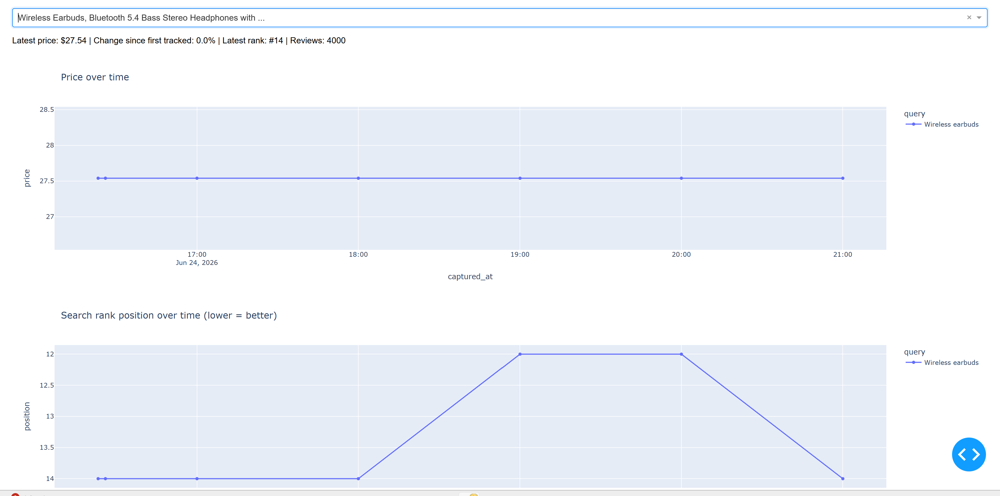
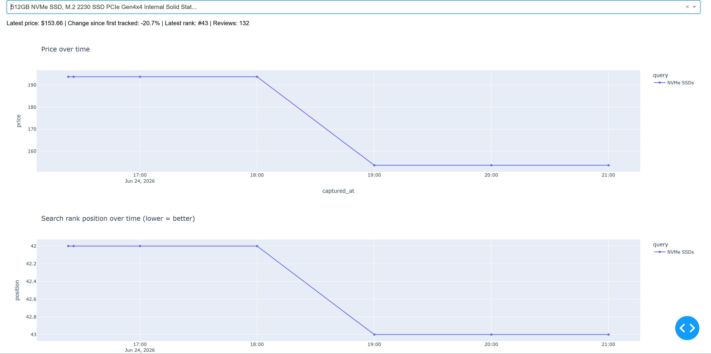

# Product Intelligence Pipeline

Tracks Amazon product listings (price, search rank, reviews) over time using
SerpAPI's `amazon` search engine, following a medallion (bronze/silver/gold)
pattern in Postgres, orchestrated by Airflow, visualized in Dash.

## Architecture

```
SerpAPI ──▶ extract.py ──▶ bronze_raw_results      (raw JSON, untouched)
                              │
                              ▼
                         transform.py               (pure functions, no DB)
                              │
                              ▼
                          load.py ──▶ silver_product_snapshot  (typed, deduped)
                              │
                              ▼
                       gold.product_dim   (latest attributes per ASIN)
                       gold.price_history (append-only time series)
                              │
                              ▼
                       dashboard/app.py (Dash) — price & rank trend charts
```
## Demo




## Findings
Wireless earbuds, air fryers, and NVMe SSDs were tracked over six consecutive hours. As illustrated above, the bass stereo headphone remained constant in price while its search rank position fluctuated. In contrast, the pricing of NVMe SSD stayed for first three hours, then dropped in the next hour. It remained unchanged in the following hours. Also, its search rank position matched this pattern. These two are just two samples of products tracked. To conclude, headphones changed either in price or search rank or both while some air fryers did not change at all. In other words, products could behave differently regardless of their categories. 

## Quickstart

1. Install Docker version 29.5.3+
2. Create .env with your SerpAPI key and settings

| Var              | Purpose                                  | Default        |
|-------------------|------------------------------------------|----------------|
| `SERPAPI_KEY`     | SerpAPI auth                             | *(required)*   |
| `TRACKED_QUERIES` | Comma-separated search terms to monitor  | `Coffee, wireless earbuds`       |
| `AMAZON_DOMAIN`   | Amazon marketplace                       | `amazon.com`   |
| `PG_HOST/PORT/DB/USER/PASSWORD` | Postgres connection         | see `config.py`|

3. Navigate to the project directory
4. Docker compose
``` bash
docker compose up --build
```
5. Go to `http://localhost:8080/`, then login with admin/admin and toggle the switch on
6. Go to `http://localhost:8050/`

## Issues

**Why split bronze/silver/gold here, specifically:**
- *Bronze* exists so a parsing bug or a SerpAPI field rename never costs you
  re-querying the API — you just re-run `transform.py`
  and `load.py` against history.
- *Silver* is one clean row per snapshot, with a `UNIQUE(asin, query,
  captured_at)` constraint so re-running load is always safe (idempotent).
- *Gold* splits into two tables for two different access patterns: a small
  dimension table (`product_dim`) for "what is this product, right now",
  and a long, append-only history table (`price_history`) for trend charts.
  Keeping these separate means the dashboard's time-series queries don't
  have to scan or repeat descriptive text columns on every row.

**Why `etl/`, `warehouse/`, and `config.py` are duplicated inside `dags/`:**

Airflow only automatically adds the `dags/` folder itself to `sys.path` —
not its parent directory. Since `docker-compose.yml` mounts `./dags` as a
volume at runtime, the actual code Airflow imports has to physically live
inside `dags/`.

**Why multiple `requirements.txt` with different names:**

Airflow pins an older SQLAlchemy (1.4.x) which silently downgrades
the version above when both are installed together, which results in 
syntax errors and dependency conflicts
